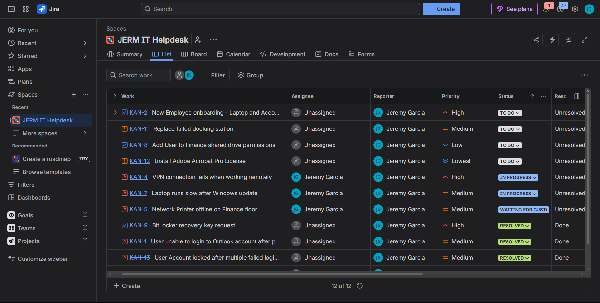
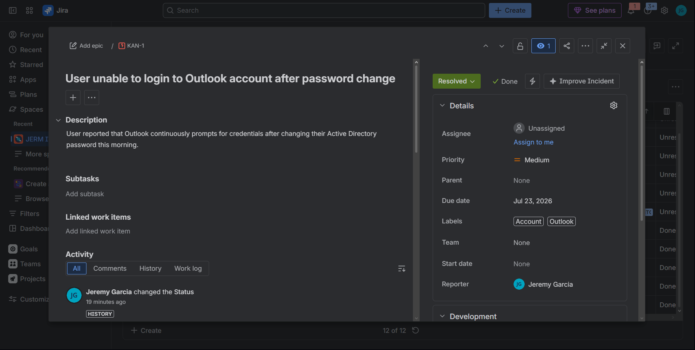
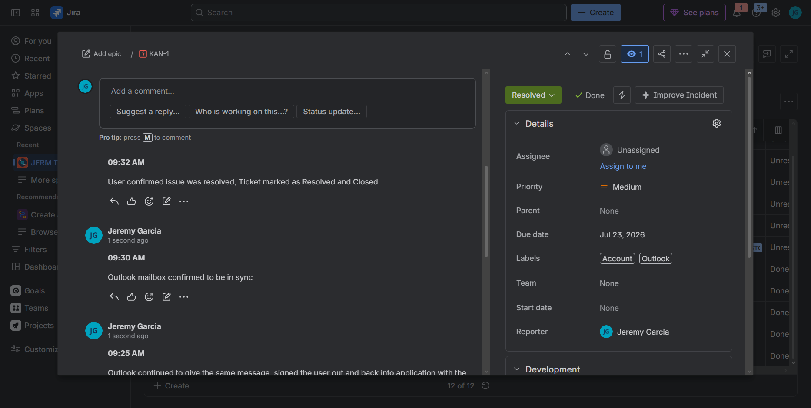
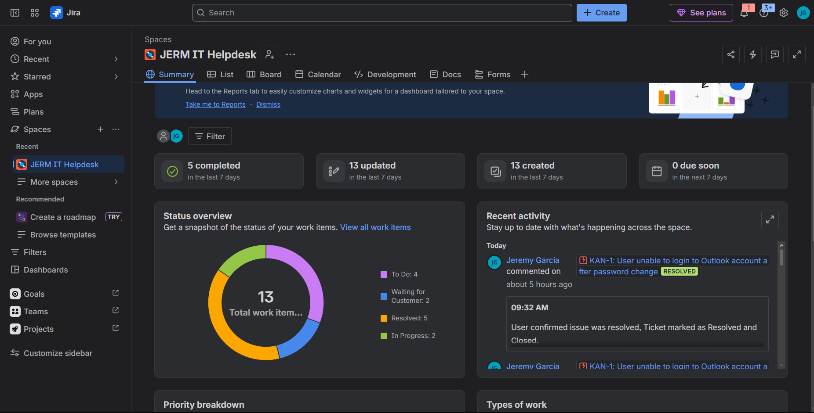
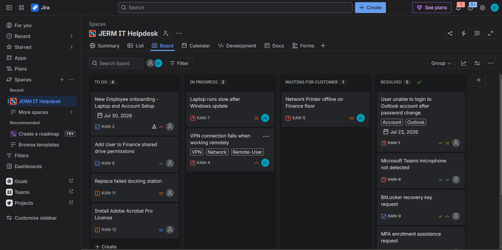
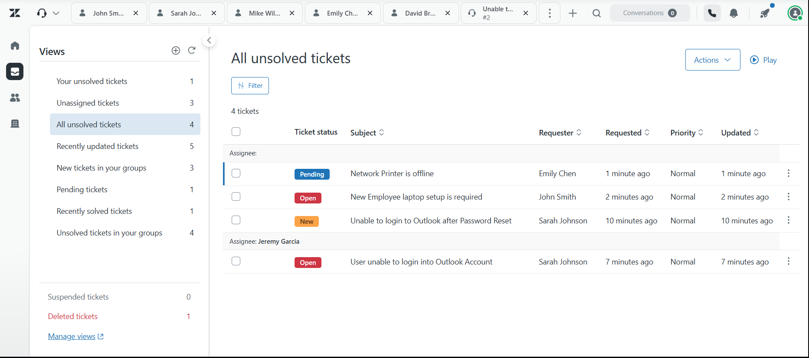
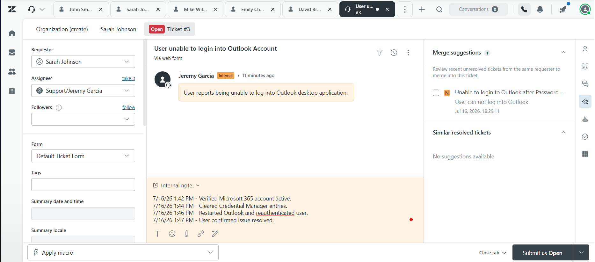

# IT-Helpdesk-Ticketing-Lab

## Overview
This project demonstrates hands-on experience with IT ticketing systems and help desk workflows using simulated environments in Jira and Zendesk.

The goal of this lab is to practice the ticket lifecycle commonly used in IT support environments, including ticket creation, prioritization, troubleshooting documentation, customer communication, escalation, and resolution tracking.

---

## Platforms I Used

- Jira
- Zendesk

---

## Skills Demonstrated

- Ticket intake and creation
- Incident prioritization and triage
- Ticket lifecycle management
- Technical documentation
- Customer communication
- Resolution tracking
- Escalation workflows
- Troubleshooting methodology

---

## Example Incident

### Outlook Login Issue
**Issue:**
User unable to access Outlook after changing password.

**Troubleshooting Steps:**
- Verified Microsoft 365 credentials.
- Confirmed Outlook Web Access functionality.
- Cleared cached credentials from Windows Credential Manager.
- Restarted Outlook and re-authenticated account.

**Resolution:**
Issue resolved after removing stale credentials and signing back into Microsoft 365.

---

## Technologies Related to This Lab

- Windows 10/11
- Microsoft 365
- Active Directory
- Jira
- Zendesk
- VPN Support
- Ticket Management
- Incident Tracking

---

## Screenshots

This repository includes screenshots demonstrating:

- Ticket creation
- Status management
- Ticket prioritization
- Resolution tracking
- Customer communication workflows

## Jira Ticketing Screenshots

## Zendesk Ticketing Screenshots

---

## Purpose

This project was created to build familiarity with help desk operations and ticketing systems commonly used in enterprise IT environments and managed service providers (MSPs).
